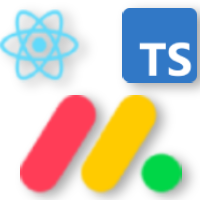
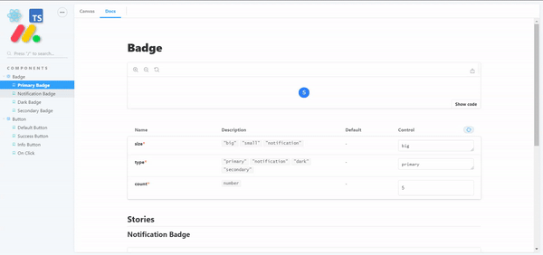

# Monday.com (DaPulse) react components

## Demo
Browse the [components library](https://monday-ui-components.netlify.app/?path=/docs/components-button--default-button)

## Guidelines
Follow [Monday's official Design system guidelines](https://design.monday.com/03276924d/p/618d70-button)

## Motivation 
This repo should serve app developers, until monday.com will release 
their official repo , or embrace this one 😁

## Tech 

- Typescript
- React
- Storybook 
- Styled-Components

## Installation

install the package from [npm registery](https://www.npmjs.com/package/monday-ui-components)

### npm
``npm i monday-ui-components``

### yarn 
``yard add monday-ui-components``

## Roadmap
Join the conversation on our monday board 👇

